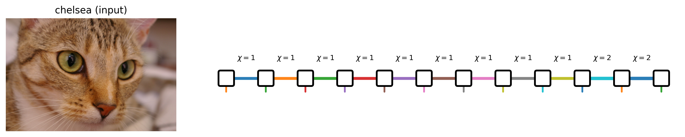

# Tensor Stream

Tensor Stream is a research codebase for **tensor-network (TT/MPS) compression of images and videos** using **bit-interleaved indexing** and **piecewise polynomial approximation**.



## Mathematical framework

### 1) 2D bit-interleaved encoding

Given image data $X \in \mathbb{R}^{r \times c}$, define a padded dyadic grid by

$$
n_x = 2^{d_x}, \qquad n_y = 2^{d_y},
$$

$$
d_x = \lceil \log_2 r \rceil, \qquad d_y = \lceil \log_2 c \rceil.
$$

Let $f(x_i, y_j) = X[i,j]$ on valid pixels and $0$ on padded locations. Write indices in binary as $i=\sum_{k=1}^{d_x} 2^{k-1} i_k$, and likewise, $j=\sum_{k=1}^{d_y} 2^{k-1} j_k$. 

Then interleave bits to form a Morton/Z-order label $s_{i,j}$:

$$
s_{i,j} = i_1 + 2 j_1 + 4 i_2 + 8 j_2 + \cdots.
$$

This yields the amplitude encoding

$$
\lvert \psi_f \rangle = \frac{1}{\|f\|}\sum_{i,j} f(x_i, y_j)\lvert s_{i,j} \rangle,
$$

where $\|f\|$ is the normalization factor.

### 2) Constructive TT/MPS for bivariate polynomials

For

$$
P(x,y) = \sum_{n=0}^{p}\sum_{m=0}^{q} a_{nm} x^n y^m,
$$

expand $P(x_1 + x_2, y_1 + y_2)$ using binomial identities and define

$$
\varphi_{k,\ell}(x,y)=\sum_{n=k}^{p}\sum_{m=\ell}^{q} a_{nm}\binom{n}{k}\binom{m}{\ell}x^{\,n-k}y^{\,m-\ell}.
$$

Collecting the $\varphi_{k,\ell}$ terms gives a first core, and repeated decomposition over digit contributions yields

$$
P(x,y) = G_1(x_1,y_1)\,G_2(x_2,y_2)\cdots G_d(x_d,y_d),
$$

which maps directly to TT/MPS cores aligned with the interleaved-bit physical ordering.

In this repository, the implementation exposes this pipeline through `tensor_stream.polynomial_tt`.

### 3) Piecewise bicubic blocks

To model non-polynomial image content, split the domain into $2^k \times 2^k$ blocks $\Omega_{u,v}$, fit a local degree-$(3,3)$ polynomial $P_{u,v}$ on each block, and define

$$
f_k(x,y)=\sum_{u=0}^{2^k-1}\sum_{v=0}^{2^k-1}
\mathbf{1}_{\Omega_{u,v}}(x,y)\,P_{u,v}(x,y).
$$

Each block polynomial can be encoded as an MPS and assembled into a global state, with controlled truncation threshold $\epsilon_{\mathrm{cut}}$ during additions/canonicalization and final compression to a target $\chi_{\max}$.

### 4) Extension to $d$ dimensions

For 

$$P(\mathbf{x})=
\sum a_{n_1,\dots,n_d}\prod_{j=1}^{d}\bigl(x^{(j)}\bigr)^{n_j},
$$

where $x^{(j)} = \sum_{r=1}^{m} x_r^{(j)}$. Applying a multinomial expansion coordinate-wise to obtain a constructive TT factorization

$$P(\mathbf{x}) = G_1(\mathbf{x}_1)\cdots G_m(\mathbf{x}_m),$$

with worst-case internal rank scaling like $\prod_j (p_j + 1)$ before truncation/compression.

---

## Project structure

```text
src/tensor_stream/
  indexing.py        # bit manipulation + interleaving utilities
  polynomial_tt.py   # constructive polynomial TT/MPS machinery
  piecewise.py       # piecewise bicubic block fitting + reconstruction
tests/
examples/
```
